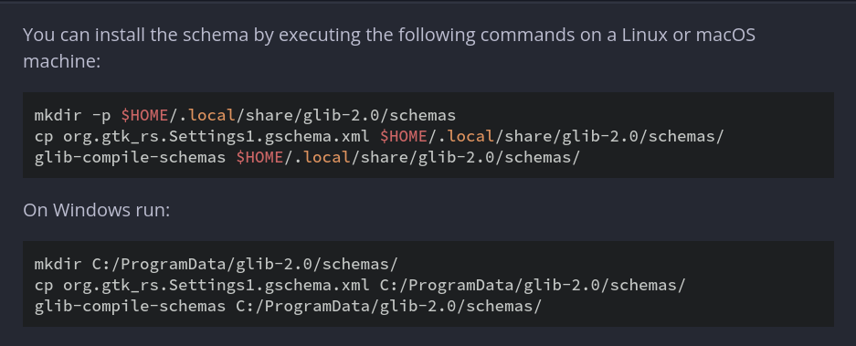

# Installation

## For gschemas
- Copy gschemas present in data/schemas and compile it as follows:

In case of GNU/Linux, append the directory of glib2.0 to XDG_DATA_DIRS environment variables
- If schemas are present under  ~/.local/share/glib-2.0/schemas/

    `export XDG_DATA_DIRS=$XDG_DATA_DIRS:$HOME/.local/share/`

# Checking for errors
`cargo check`

# Building
Debug: `cargo build`

Release: `cargo build --release`

# Running
`cargo run`